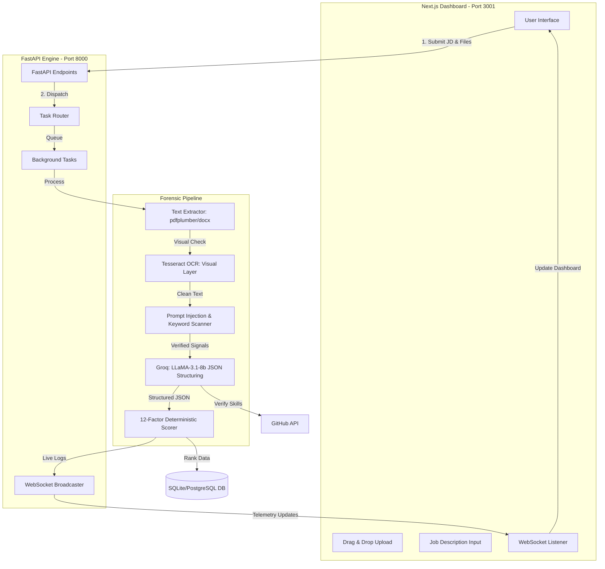

# TalentScout AI // NEURAL_RESUME_INTELLIGENCE

**Next-Gen AI-Powered Resume Scoring & Forensic Intelligence System**


TalentScout AI is an advanced resume parsing, forensic analysis, and ranking engine designed for high-stakes recruitment. It leverages **Groq (LLaMA-3.1-8b)** for intelligent extraction, **Tesseract OCR** for visual verification, and a deterministic 12-factor scoring algorithm to eliminate hiring bias and prevent resume manipulation.

---

## 🏗️ System Architecture



---

## 🔄 The TalentScout Process (Workflow)

1.  **Ingestion & Forensic X-Ray**: Upon upload, the system performs a dual-path extraction. It reads the raw digital text while simultaneously using **Tesseract OCR** to see what a human sees.
2.  **Security Firewall**: The text is immediately scanned for **Prompt Injection** (malicious hidden instructions) and **Keyword Stuffing** (hidden invisible text). 
3.  **Neural Structuring**: Cleaned text is passed to **Groq (Llama-3)** which extracts structured JSON data (Internships, CGPA, Projects, etc.) with 98% accuracy.
4.  **Deterministic Scoring**: Every candidate is graded on a **100-point scale** across 12 weighted criteria. A **JD Alignment Bonus** is applied if the candidate's skills mathematically match the provided Job Description.
5.  **GitHub Verification**: If a GitHub link is found, we query the **GitHub API** to cross-reference claimed skills with real-world commit history.
6.  **AI Synthesis**: The engine generates a human-readable synthesis report, including strengths, weaknesses, and tailored interview questions.

---

## 🚀 Key Features

- **Forensic Security**: Detects and flags malicious prompt injections and hidden "invisible" keywords.
- **OCR-Priority Scoring**: Ignores hidden text layers by prioritizing the visual (OCR) layer for scoring accuracy.
- **12-Factor Ranker**: A research-backed scoring model covering internships, projects, CGPA, achievements, and more.
- **JD Alignment**: Dynamically recalculates scores based on specific Job Description requirements.
- **GitHub Trust Engine**: Verifies technical claims via live GitHub profile analysis.
- **Neural Telemetry**: Real-time WebSocket logs showing the "AI Thinking Process" as it analyzes each resume.
- **Compact Synthesis**: AI-generated executive summaries and pros/cons lists optimized for rapid scanning.
- **Interactive Chat**: Ask the AI direct questions about any candidate's experience.

---

## 🛠️ Local Development Setup

**Prerequisites**: Python 3.9+, Node.js 18+, Tesseract OCR (Windows)

### 1. Clone & Setup
```bash
git clone https://github.com/shashank-tomar0/TalentScout-AI.git
cd TalentScout-AI
```

### 2. Configure Keys
Create a `.env` file in the backend root:
```env
GROQ_API_KEY=your_groq_api_key
```

### 3. Start the System (One-Click)
```bash
# Windows
start_talentscout.bat
```
This launches:
- **Backend API**: `http://localhost:8000`
- **Dashboard UI**: `http://localhost:3001`
- **Legacy ATS Dashboard**: `http://localhost:3000`

---

## 📜 License
MIT License. Built by **Team Xnords**.
