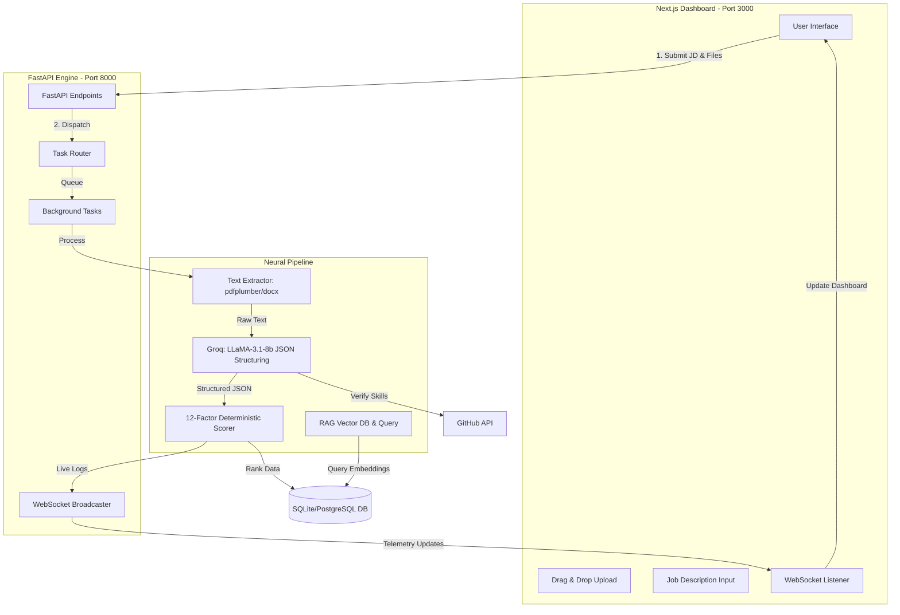

# TalentScout AI // NEURAL_RESUME_INTELLIGENCE

**Next-Gen AI-Powered Resume Scoring & Intelligence System**


TalentScout AI is an advanced resume parsing and ranking engine designed for high-volume recruitment. Moving beyond simple keyword matching, it leverages **Groq (LLaMA-3.1-8b)** for intelligent structural extraction, a deterministic 12-factor scoring algorithm, and a real-time **RAG pipeline** to interact with candidate data. 

---

## 🚀 Key Features

- **Intelligent Extraction**: Uses Groq (LLaMA-3.1-8b) to convert unstructured PDF/DOCX text into structured JSON fields (skills, CGPA, internships, projects) with built-in hallucination guards.
- **JD Context Matching**: Paste a Job Description to recalculate scores dynamically based on context and alignment. Flags missing skills and boosts matching ones.
- **GitHub Verification**: Auto-detects GitHub profiles, cross-referencing claimed skills against actual commit activity and repositories via the GitHub API.
- **RAG Pipeline (Chat with Resume)**: Ask direct questions to any resume ("Does Priya have Docker experience in production?"). Answers are grounded explicitly in the candidate's text.
- **AI Email Drafting**: One-click generation of personalized accept/reject emails via LLM, complete with candidate highlights.
- **Real-Time Telemetry**: WebSocket-powered live stream of processing steps for absolute transparency. No black boxes.

---

## 🏗️ System Architecture



---

## 🛠️ Local Development Setup

**Prerequisites**: Python 3.9+ & Node.js 18+

### 1. Clone the repository
```bash
git clone https://github.com/shashank-tomar0/RankSense-AI.git
cd RankSense-AI
```

### 2. Environment Variables
Create a `.env` file in the backend root and configure your Groq API key:
```env
GROQ_API_KEY=your_groq_api_key_here
```

### 3. Start the System (One-Click)
We provide a unified batch script to install dependencies and boot the backend server:
```bash
# Windows
start_talentscout.bat
```
*(This launches the FastAPI application on `http://localhost:8000`)*

### 4. Start the Frontend
In a new terminal, spin up the Next.js UI:
```bash
cd frontend
npm install
npm run dev
```
*(This launches the Talentscout Dashboard on `http://localhost:3000`)*

---

## 🧠 How the Backend Pipeline Works

When files are uploaded, `main.py` executes a heavily optimized pipeline:

1. **Async Ingestion**: Files are received via FastAPI `BackgroundTasks`. The server never blocks; large batches process in parallel.
2. **Text Normalization**: `pdfplumber` and `python-docx` extract layout-preserved text. 
3. **Neural Extraction**: Unstructured text is passed to **Groq**. Prompt engineering coerces the LLM to output a strict JSON schema containing Experience, Projects, Skills, and Metrics.
4. **Gap Analysis & Scoring**: The engine calculates a dynamic score based on the extracted JSON vs the Job Description. It weighs Internships (20%), Projects (15%), Skills (20%), and CGPA (10%) deterministically.
5. **Persistence & Broadcasting**: Results are persisted in SQLite. A JSON payload is concurrently broadcast via **WebSockets**, instantly updating the UI's real-time radar charts and rank table.

---

## 🌍 Production Deployment Guide

To deploy TalentScout AI for a production hackathon showcase, we recommend splitting the architecture:

### Frontend (Vercel)
1. Fork/Push this repository to GitHub.
2. Go to [Vercel](https://vercel.com) and click **"Add New Project"**.
3. Import your repository. 
4. Set the **Framework Preset** to `Next.js` and the **Root Directory** to `frontend`.
5. Click **Deploy**. Vercel will automatically provision a global CDN for the UI.

### Backend (Render or Railway)
1. Go to [Render](https://render.com) and create a new **Web Service**.
2. Connect your GitHub repository.
3. Set the **Build Command**: `pip install -r requirements.txt`
4. Set the **Run Command**: `uvicorn main:app --host 0.0.0.0 --port 10000`
5. Add your Environment Variables (e.g., `GROQ_API_KEY`).
6. Click **Deploy**.

**Important**: Once your backend is deployed, copy its public URL (e.g., `https://talentscout-api.onrender.com`) and update your Frontend's `.env.local` to point the UI to your live API.

---

## 📜 License
MIT License. Built by **Team Xnords**.
